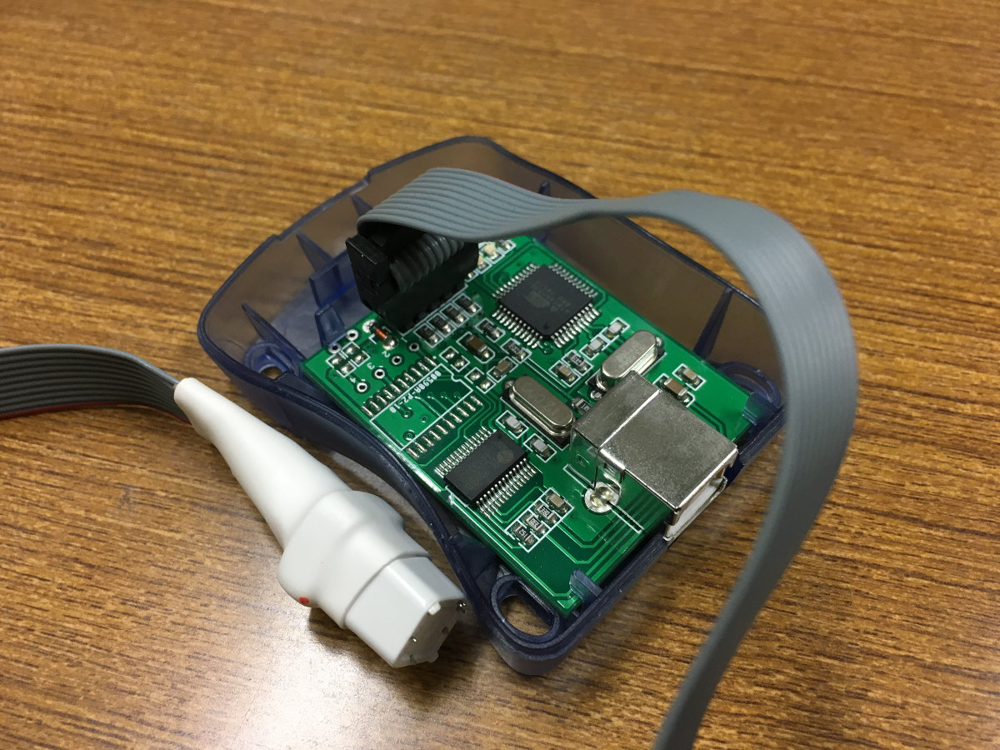
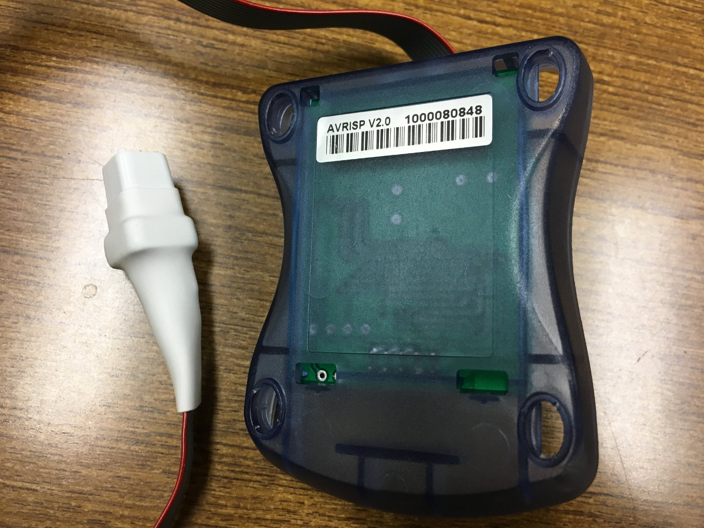
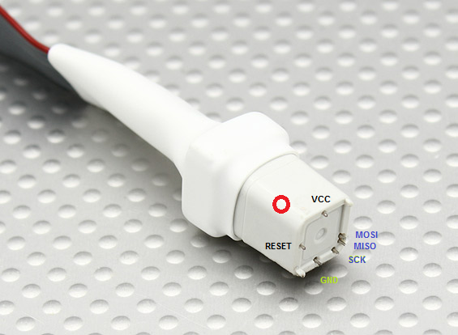
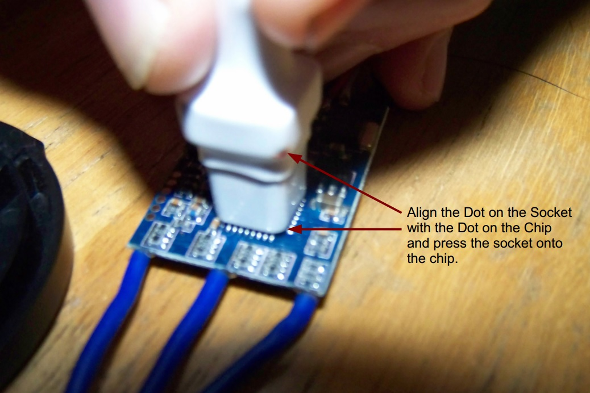
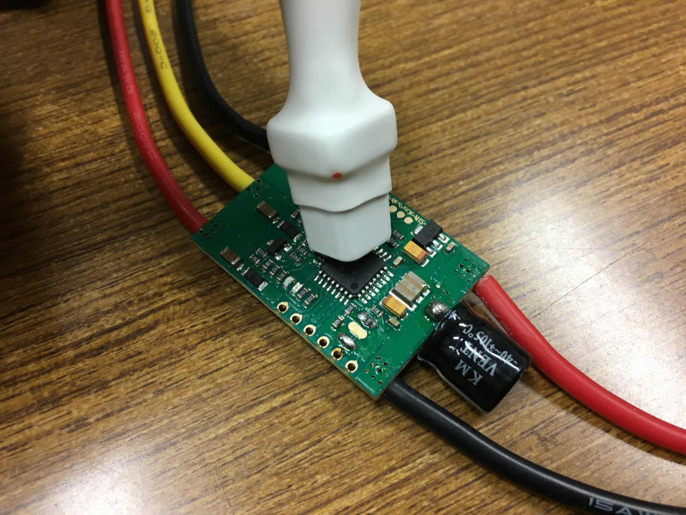

# FlightCtrl

## 制御アルゴリズム

高レベル制御コマンドとしてターゲット位置、ターゲット方位およびこれらの最大遷移速度を受けつけ、低レベル制御コマンドの角加速度コマンドとz機軸加速度コマンドを生成する。
特徴として、中間コマンドに各速度コマンドと機体座標における重力ベクトルのコマンドを保持すること、姿勢表現にクオータニオンを用いていることが挙げられる。

この制御機構は遷移速度v_transitと遷移角速度psidot_transitによってターゲットが遠く離れている場合に制御コマンドを制限できるようになっているが、v_transitとpsidot_transitが無限大の極限でx,y,z,psi方向が互いに独立な状態量フィードバック制御に帰着する。したがって制御器の設計には極配置法や最適レギュレータなどの手法を利用することができる。


<details>
  <summary></summary>
  control_scheme
  digraph G {
    subgraph cluster_0 {
      x_target
      y_target
      z_target
      v_transit
      psi_target
      psidot_transit
      label = "original commands";
    }
    subgraph cluster_1 {
      gbx_target
      gby_target
      p_command
      q_command
      r_command
      label = "intermediate commands";
    }
    subgraph cluster_2 {
      pdot_command
      qdot_command
      rdot_command
      wdot_command
      label = "control commands";
    }
    u_command[label="u_command=0"]
    v_command[label="v_command=0"]
    w_command[label="w_command=0"]
    form_angular_rate_command[shape=box]
    form_psi_command[shape=box]
    psi_target -> form_psi_command;
    psidot_transit -> form_psi_command;
    form_psi_command -> psi_command;
    psidot_transit -> form_angular_rate_command
    form_angular_rate_command -> p_command
    form_angular_rate_command -> q_command
    form_angular_rate_command -> r_command
    form_position_command[shape=box]
    x_target -> form_position_command
    y_target -> form_position_command
    z_target -> form_position_command
    v_transit -> form_position_command
    form_position_command -> x_command
    form_position_command -> y_command
    form_position_command -> z_command
    x_command -> gbx_target[label="kx"]
    y_command -> gby_target[label="ky"]
    u_command -> gbx_target[label="ku"]
    v_command -> gby_target[label="kv"]
    gbx_target -> theta_command
    gby_target -> phi_command
    q_command -> qdot_command[label="kq"]
    p_command -> pdot_command[label="kp"]
    r_command -> rdot_command[label="kr"]
    theta_command -> qdot_command[label="ktheta"]
    phi_command -> pdot_command[label="kphi"]
    psi_command -> rdot_command[label="kpsi"]
    z_command -> wdot_command[label="kz"]
    w_command -> wdot_command[label="kw"]
    pdot_command -> pdot_command[label="kpdot"]
    qdot_command -> qdot_command[label="kqdot"]
    wdot_command -> wdot_command[label="kwdot"]
  }
  control_scheme
</details>

## S.Busの処理


現状(Mode 1)

Switch|Channel|Function
------|-------|--------
J1|0|roll
J3|1|pitch
J2|2|thrust
J4|3|yaw
T1|8|trim 0
T2|9|trim 1
T3|10|trim 2
T4|11|trim 3
SA|4|switch 0/route selection
SB|6|switch 1?
SC|6|switch 2?
SD|7|takeoff
SE|5|nav control
SF|16|altitude control
SG|6|go home?
SH|17|on-off
LD|6|switch 3?
RD|6|switch 4?

SBusSwitch(0)=>ROUTE (enum, 0,1,2)

SBusSwitch(1)=>?

```c
static enum NavModeBits {
  NAV_BIT_MODE_0     = 1<<0,
  NAV_BIT_MODE_1     = 1<<1,
  NAV_BIT_HOLD_RESET = 1<<2,
  NAV_BIT_RESERVED_0 = 1<<3,
  NAV_BIT_ROUTE_0    = 1<<4, // route lower bit
  NAV_BIT_ROUTE_1    = 1<<5, // route upper bit
  NAV_BIT_SWITCH_0   = 1<<6, // route switch lower bit
  NAV_BIT_SWITCH_1   = 1<<7, // route switch upper bit
} nav_mode_request_;
```

### 変更予定
現状ではメンテナンス性が悪いので以下に変更予定。
この変更によりFutaba 14SGの設定も変える必要が生じる。
また、RouteスイッチをDOWN以外にした時のNaviCtrl側の処理も今後追加する必要がある。


Switch|Channel|Function
------|-------|--------
J1|0|roll
J2|1|thrust
J3|2|pitch
J4|3|yaw
T1|4|trim 0
T2|5|trim 1
T3|6|trim 2
T4|7|trim 3
SA|8|switch 0/route selection
SB|9|switch 1/-
SC|10|switch 2/land
SD|11|switch 3/takeoff
SE|12|switch 4/nav control
SF|13|switch 5/altitude control
SG|14|switch 6/go home
SH|15|switch 7/on-off
LD|16|switch 8/-
RD|17|switch 9/-

sbus.c
```c
void SBusSetChannels(uint8_t roll, uint8_t thrust, uint8_t pitch, uint8_t yaw,
  uint8_t trim0, uint8_t trim1, uint8_t trim2, uint8_t trim3,
  uint8_t switch0, uint8_t switch1, uint8_t switch2, uint8_t switch3,
  uint8_t switch4, uint8_t switch5, uint8_t switch6, uint8_t switch7,
  uint8_t switch8, uint8_t switch9)
{
  channel_pitch_ = pitch;
  channel_roll_ = roll;
  channel_yaw_ = yaw;
  channel_thrust_ = thrust;
  channel_on_off_ = switch7;
  channel_altitude_control_ = switch5;
  channel_nav_control_ = switch4;
  channel_takeoff_ = switch7;
  channel_go_home_ = switch6;
  channel_route_ = switch 0;
  channel_switch_[0] = switch1; // unused
  channel_switch_[1] = switch2; // unused
  channel_switch_[2] = switch8; // unused
  channel_switch_[3] = switch9; // unused
  channel_trim_[0] = trim0;
  channel_trim_[1] = trim1;
  channel_trim_[2] = trim2;
  channel_trim_[3] = trim3;

  eeprom_update_byte(&eeprom.sbus_channel_pitch, pitch);
  eeprom_update_byte(&eeprom.sbus_channel_roll, roll);
  eeprom_update_byte(&eeprom.sbus_channel_yaw, yaw);
  eeprom_update_byte(&eeprom.sbus_channel_thrust, thrust);
  eeprom_update_byte(&eeprom.sbus_channel_on_off, switch7);
  eeprom_update_byte(&eeprom.sbus_channel_altitude_control, switch5);
  eeprom_update_byte(&eeprom.sbus_channel_nav_control, switch4);
  eeprom_update_byte(&eeprom.sbus_channel_takeoff, switch7);
  eeprom_update_byte(&eeprom.sbus_channel_go_home, switch6);
  eeprom_update_block((const void*)channel_switch_,
    (void*)&eeprom.sbus_channel_switch[0], sizeof(channel_switch_));
  eeprom_update_block((const void*)channel_trim_,
    (void*)&eeprom.sbus_channel_trim[0], sizeof(channel_trim_));
}
```

main.c

```c
SBusSetChannels(0, 1, 2, 3, 4, 5, 6, 7, 8, 9, 10, 11, 12, 13, 14, 15, 16, 17);
```

## ESCとの接続

ハードウェアはAfro ESCを使い、Simon-Kファームウェアを一部書き換える。
Afro ESCはデフォルトでSimon-Kファームウェアが入っており、はPWM入力を受けるようになっているが、I2Cのピンに接続することで自動的にI2Cモードになるようになっている。しかし、I2Cはバス接続であるという特性上、それぞれのESCにモーター番号(Motor ID)を割り当てなければならない。これを行うためには、Simon-Kファームウェアをダウンロード、Motor IDを1,2,3,4等に変更してビルドし、ESCに書き込む(flashする)必要がある。


以下の記事が参考になる。
https://www.rcgroups.com/forums/showthread.php?1949316-How-do-I-hook-up-Afro-ESC-to-Mikrokopter-I2C

```
Default firmware ships for motor #1 only. User needs to build and flash firmware for other motor index.
https://github.com/sim-/tgy/blob/master/tgy.asm#L173
Set I2C_ADDR to 0x50 (default motor start address). Then change MOTOR_ID to 1, 2, 3, 4,... etc to match motor index, rebuild firmware, and flash afro_nfet.hex using USB linker.
```
[参考：Google code](https://code.google.com/archive/p/afrodevices/wikis/AfroESC.wiki)


### 必要なもの
 - Afro ESC本体
 - AVRISP mk.IIとAtmel Atmega Socket Firmware Flashing Tool
   * PCとESCを接続するためのツール(AVRマイコンにファイルを書き込むISPプログラマ)
   * Flashing ToolをESCのチップにかぶせることでフラッシュできる
   * 代替ツールも多く存在する(KKMulticopter Flashtoolの公式サイトに対応デバイスがリストアップされている)
   * https://hobbyking.com/en_us/atmel-atmega-socket-firmware-flashing-tool.html
 - KKMulticopter Flashtool
   * ビルドしたファームウェアを書き込むためのツール
   * 事前にJavaをインストールしておく必要がある
   * Linux版を強く勧める。Windows版はドライバのインストールなど煩雑な手続きが必要
   * http://lazyzero.de/en/modellbau/kkmulticopterflashtool よりlatest stable versionをインストール

### 手順
 1. Simon-Kをビルドするツール(AVRA 1.3.0以降)をダウンロード、インストール
    ```
    Building from Source
    AVRA 1.3.0 or newer or avrasm2, part of the AVR Tools, should assemble this source. AVRA should also build on a Mac. "make all" will emit a .hex file for every build target; "make binary_zip" will make a release .zip file. There are some other make targets for programming.
    In AVR Studio, the Makefile is not supported, and just loading tgy.asm and attempting to build it will not define the constant indicating the board type / build target. You must either edit tgy.asm or add an option for the assembler command line to define the board symbol, unless building the default "tgy" board type. For example, this option should emit the bs_nfet target: -D bs_nfet_esc=bs_nfet_esc Look near the top of tgy.asm for the includes and board information.
    URL: https://github.com/sim-/tgy/blob/master/README.md
    ```
    以下のコマンドを実行すればよい
    ```
    sudo apt-get install avra
    ```
 1. Simon-Kファームウェアをgithubからクローンし、tgy.asmのMOTOR_IDを設定したい番号に変えてからビルド。たくさんのファイルが生成されるが、このうちAfroESCに書き込むファイルはafro_nfet.hexのみである。

    /tgyの中で以下のコマンドを実行すればよい
    ```
    make all
    ```
 1. PCとESCを接続し、フラッシュ用ツール(KKMulticopter Flashtool)でビルドしたhexファイルを書き込む。プログラマはavrisp mkii、ポートはプログラマが接続されているポート(例:/dev/ttyUSB1)、通信設定はデフォルト、書き込むファイルは個別に指定(自分でビルドしたafro_nfet.hexを選択)
    ```
    1. Install the Silab driver- http://www.silabs.com/products/mcu/pages/usbtouartbridgevcpdrivers.aspx
    2. Install KKMulticopter Flash Tool (KKFlashTool) v0.76 - http://www.lazyzero.de/en/modellbau/kkmulticopterflashtool
    3. Disconnect motors from ESCs.
    4. Disconnect ESCs from FC Board.
    5. Connect battery to Power Distribution Board to power ESCs.
    6. Connect 1st ESC to the Afro ESC USB Programming Tool - ensure ESC brown wire connects to (-) on the Programming Tool.
    7. Open KKFlashTool.
    8. Select the following settings:  - Programmer: Afro USB Programming Tool (afrousb) - Port: /dev/cu.SLAB_USBtoUART {tick checkbox to use defaults} - Controller: atmega 8-based brushlessESC (8kb flash) - Repository: Afro NFET - Firmware: Select as appropriate.
    9. Click the green ‘running man’ button and wait until final message in bottom window reads ...”Flashing of firmware was successful.”
    10.  Repeat for next ESC  For
    URL: https://hobbyking.com/media/file/73530954X1785910X23.pdf
    ```

### AVRISP mk.II

AVRISP mk.IIとFlashing toolを接続した様子。
前



後




### Flashing toolとESCの物理的接続



参考: [Atmel Atmega Socket Firmware Flashing Tool > Upload Files > Tool orientation ](https://hobbyking.com/en_us/atmel-atmega-socket-firmware-flashing-tool.html)



参考: [Flash ESC with 1-Wire Bootloader Interface – Via Signal cable – SN20A with BLHeli](https://oscarliang.com/esc-1-wire-bootloader-signal-cable-blheli-simonk/)



### AVRISP MK IIドライバのインストール(Windowsのみ、Linuxを推奨)
Linuxの場合はこの手続きは不要である。Windowsの場合は面倒。
AVRISP mk.IIのドライバが必要なほか、AVRISP mk IIボード上のPL2303HXというUSB-Serial変換ドライバのダウングレードが必要になる(Windows 8以降が非対応であるため)。
前者はAtmel Studio導入時にインストールされる。
後者は以下を参照
http://d.hatena.ne.jp/murase_syuka/20160503/1462235398
