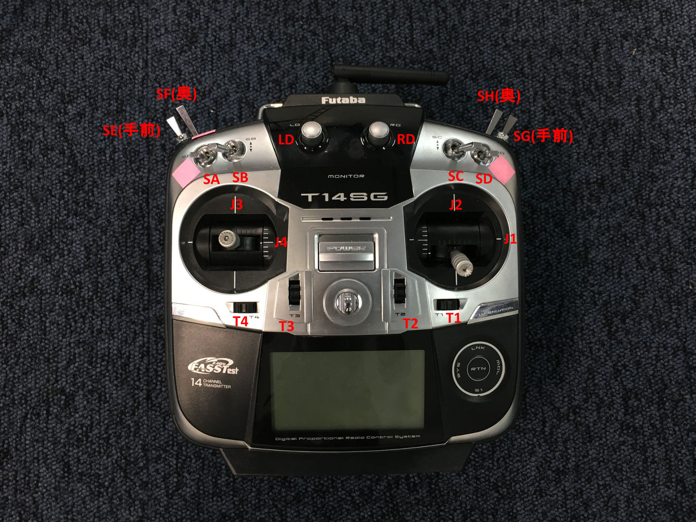

# マルチコプター開発ガイド

## 概要

このガイドは、マルチコプターの開発に必要なハードウェア、ソフトウェア、通信プロトコル等の情報を網羅する目的で作成した。

記載情報は適宜更新してゆく予定である。

### カスタムファームウェア

FlightCtrl: https://github.com/kurokis/FlightCtrl2

NaviCtrl: https://github.com/Akihiro-K/RasPiMain


### ハードウェア構成


#### WaypointControllerとNaviCtrlの接続について

WaypointControllerとNaviCtrlの通信はUARTであるが、NaviCtrl側の接続はRaspberry PiのGPIOピンではなく**USBポート**を使う。これは、NaviCtrlのGPIOピンがFlightCtrlとの通信で占有されているからである。一方、WaypointController側の接続はGPIOピンを使う。

~~通信にはMONOSTICKを使うことを考えている。MONOSTICKはUSBポートに差し込むことでデバイス間の無線シリアル通信を可能にする。~~

~~[MONOSTICK 公式ウェブサイト](https://mono-wireless.com/jp/products/MoNoStick/index.html)~~

~~有線での通信も検討しているが、USB->シリアル->USBという2重の変換が必要となるため、この変換用の制御ボードを別途作らなければならない可能性がある。構成のシンプルさを優先するため、現在はMONOSTICKの利用が有力と考えている。~~

## 開発用Ubuntuマシンのセットアップ

FlightCtrlはUbuntuマシンから書き込む必要がある。

[Ubuntuマシンのセットアップ](ubuntu_setup.html)

## Raspberry Pi 3のセットアップ

NaviCtrlはRaspberry Pi 3上で動作する。

[Raspberry Piのセットアップ](rpi_setup.html)

## Linux Cheat Sheet

Linux共通(開発用Ubuntuマシン、Raspberry Pi)のチートシート

[Cheat Sheet](linux_cheat_sheet.html)

## 通信プロトコル


FlightCtrl, NaviCtrl(RasPiMain, Marker, GPSServer), WaypointController間の通信はすべてUT Protocolに基づくシリアル通信で行う。
[UT Protocolの詳細](ut_protocol.html)

MainProcess, MarkerProcess, GPSProcess間の通信はTCP通信で行う。


## FlightCtrl

### 制御アルゴリズム

高レベル制御コマンドとしてターゲット位置、ターゲット方位およびこれらの最大遷移速度を受けつけ、低レベル制御コマンドの角加速度コマンドとz機軸加速度コマンドを生成する。
特徴として、中間コマンドに各速度コマンドと機体座標における重力ベクトルのコマンドを保持すること、姿勢表現にクオータニオンを用いていることが挙げられる。

この制御機構は遷移速度v_transitと遷移角速度psidot_transitによってターゲットが遠く離れている場合に制御コマンドを制限できるようになっているが、v_transitとpsidot_transitが無限大の極限でx,y,z,psi方向が互いに独立な状態量フィードバック制御に帰着する。したがって制御器の設計には極配置法や最適レギュレータなどの手法を利用することができる。


<details>
  <summary></summary>
  control_scheme
  digraph G {
    subgraph cluster_0 {
      x_target
      y_target
      z_target
      v_transit
      psi_target
      psidot_transit
      label = "original commands";
    }
    subgraph cluster_1 {
      gbx_target
      gby_target
      p_command
      q_command
      r_command
      label = "intermediate commands";
    }
    subgraph cluster_2 {
      pdot_command
      qdot_command
      rdot_command
      wdot_command
      label = "control commands";
    }
    u_command[label="u_command=0"]
    v_command[label="v_command=0"]
    w_command[label="w_command=0"]
    form_angular_rate_command[shape=box]
    form_psi_command[shape=box]
    psi_target -> form_psi_command;
    psidot_transit -> form_psi_command;
    form_psi_command -> psi_command;
    psidot_transit -> form_angular_rate_command
    form_angular_rate_command -> p_command
    form_angular_rate_command -> q_command
    form_angular_rate_command -> r_command
    form_position_command[shape=box]
    x_target -> form_position_command
    y_target -> form_position_command
    z_target -> form_position_command
    v_transit -> form_position_command
    form_position_command -> x_command
    form_position_command -> y_command
    form_position_command -> z_command
    x_command -> gbx_target[label="kx"]
    y_command -> gby_target[label="ky"]
    u_command -> gbx_target[label="ku"]
    v_command -> gby_target[label="kv"]
    gbx_target -> theta_command
    gby_target -> phi_command
    q_command -> qdot_command[label="kq"]
    p_command -> pdot_command[label="kp"]
    r_command -> rdot_command[label="kr"]
    theta_command -> qdot_command[label="ktheta"]
    phi_command -> pdot_command[label="kphi"]
    psi_command -> rdot_command[label="kpsi"]
    z_command -> wdot_command[label="kz"]
    w_command -> wdot_command[label="kw"]
    pdot_command -> pdot_command[label="kpdot"]
    qdot_command -> qdot_command[label="kqdot"]
    wdot_command -> wdot_command[label="kwdot"]
  }
  control_scheme
</details>

### S.Bus



現状(Mode 1)

Switch|Channel|Function
------|-------|--------
J1|0|roll
J3|1|pitch
J2|2|thrust
J4|3|yaw
T1|8|trim 0
T2|9|trim 1
T3|10|trim 2
T4|11|trim 3
SA|4|switch 0/route selection
SB|6|switch 1?
SC|6|switch 2?
SD|7|takeoff
SE|5|nav control
SF|16|altitude control
SG|6|go home?
SH|17|on-off
LD|6|switch 3?
RD|6|switch 4?

SBusSwitch(0)=>ROUTE (enum, 0,1,2)

SBusSwitch(1)=>?

```c
static enum NavModeBits {
  NAV_BIT_MODE_0     = 1<<0,
  NAV_BIT_MODE_1     = 1<<1,
  NAV_BIT_HOLD_RESET = 1<<2,
  NAV_BIT_RESERVED_0 = 1<<3,
  NAV_BIT_ROUTE_0    = 1<<4, // route lower bit
  NAV_BIT_ROUTE_1    = 1<<5, // route upper bit
  NAV_BIT_SWITCH_0   = 1<<6, // route switch lower bit
  NAV_BIT_SWITCH_1   = 1<<7, // route switch upper bit
} nav_mode_request_;
```

#### 変更予定
現状ではメンテナンス性が悪いので以下に変更予定。
この変更によりFutaba 14SGの設定も変える必要が生じる。
また、RouteスイッチをDOWN以外にした時のNaviCtrl側の処理も今後追加する必要がある。


Switch|Channel|Function
------|-------|--------
J1|0|roll
J2|1|thrust
J3|2|pitch
J4|3|yaw
T1|4|trim 0
T2|5|trim 1
T3|6|trim 2
T4|7|trim 3
SA|8|switch 0/route selection
SB|9|switch 1/-
SC|10|switch 2/land
SD|11|switch 3/takeoff
SE|12|switch 4/nav control
SF|13|switch 5/altitude control
SG|14|switch 6/go home
SH|15|switch 7/on-off
LD|16|switch 8/-
RD|17|switch 9/-

sbus.c
```c
void SBusSetChannels(uint8_t roll, uint8_t thrust, uint8_t pitch, uint8_t yaw,
  uint8_t trim0, uint8_t trim1, uint8_t trim2, uint8_t trim3,
  uint8_t switch0, uint8_t switch1, uint8_t switch2, uint8_t switch3,
  uint8_t switch4, uint8_t switch5, uint8_t switch6, uint8_t switch7,
  uint8_t switch8, uint8_t switch9)
{
  channel_pitch_ = pitch;
  channel_roll_ = roll;
  channel_yaw_ = yaw;
  channel_thrust_ = thrust;
  channel_on_off_ = switch7;
  channel_altitude_control_ = switch5;
  channel_nav_control_ = switch4;
  channel_takeoff_ = switch7;
  channel_go_home_ = switch6;
  channel_route_ = switch 0;
  channel_switch_[0] = switch1; // unused
  channel_switch_[1] = switch2; // unused
  channel_switch_[2] = switch8; // unused
  channel_switch_[3] = switch9; // unused
  channel_trim_[0] = trim0;
  channel_trim_[1] = trim1;
  channel_trim_[2] = trim2;
  channel_trim_[3] = trim3;

  eeprom_update_byte(&eeprom.sbus_channel_pitch, pitch);
  eeprom_update_byte(&eeprom.sbus_channel_roll, roll);
  eeprom_update_byte(&eeprom.sbus_channel_yaw, yaw);
  eeprom_update_byte(&eeprom.sbus_channel_thrust, thrust);
  eeprom_update_byte(&eeprom.sbus_channel_on_off, switch7);
  eeprom_update_byte(&eeprom.sbus_channel_altitude_control, switch5);
  eeprom_update_byte(&eeprom.sbus_channel_nav_control, switch4);
  eeprom_update_byte(&eeprom.sbus_channel_takeoff, switch7);
  eeprom_update_byte(&eeprom.sbus_channel_go_home, switch6);
  eeprom_update_block((const void*)channel_switch_,
    (void*)&eeprom.sbus_channel_switch[0], sizeof(channel_switch_));
  eeprom_update_block((const void*)channel_trim_,
    (void*)&eeprom.sbus_channel_trim[0], sizeof(channel_trim_));
}
```

main.c

```c
SBusSetChannels(0, 1, 2, 3, 4, 5, 6, 7, 8, 9, 10, 11, 12, 13, 14, 15, 16, 17);
```

## NaviCtrl

### ライブラリ依存関係

![](http://g.gravizo.com/g?
  digraph G {
    aruco [shape=box3d];
    Eigen3 [shape=box3d];
    OpenCV2 [shape=box3d];
    raspicam [shape=box3d];;
    disp [shape=box];
    gps [shape=box];
    logger [shape=box];
    marker [shape=box];
    tcp [shape=box];
    navigator [shape=box];
    nc [shape=box];
    serial [shape=box];
    stateestimator [shape=box];
    shared [shape=box];
    utserial [shape=box];
    RasPiMain [shape=Msquare];
    Marker [shape=Msquare];
    GPSServer [shape=Msquare];
    aruco -> marker;
    Eigen3 -> marker;
    Eigen3 -> stateestimator;
    OpenCV2 -> marker;
    raspicam -> Marker;
    disp -> nc;
    gps -> RasPiMain;
    gps -> GPSServer;
    logger -> nc;
    marker -> Marker;
    navigator -> nc;
    nc -> RasPiMain;
    serial -> gps;
    serial -> utserial;
    stateestimator -> nc;
    shared -> disp;
    shared -> logger;
    shared -> navigator;
    shared -> stateestimator;
    tcp -> RasPiMain;
    tcp -> Marker;
    tcp -> GPSServer;
    utserial -> RasPiMain;
    Marker -> RasPiMain;
    GPSServer -> RasPiMain;
  }
)

## Waypoints

詳細はTBD


<details>
<summary></summary>
route_manager
digraph G {
  subgraph cluster_0{
    label = "Route Manager";
    subgraph cluster_1 {
      label = "Route 0 (from file)";
      style = "filled";
      wp00[label="waypoint 0"];
      wp01[label="waypoint 1"];
      wp02[label="waypoint 2"];
      wp03[label="waypoint 3"];
      wp00 -> wp01;
      wp01 -> wp02;
      wp02 -> wp03;
    }
    subgraph cluster_2 {
      label = "Route 1 (from file)";
      style= "filled";
      wp10[label="waypoint 0"];
      wp11[label="waypoint 1"];
      wp12[label="waypoint 2"];
      wp13[label="waypoint 3"];
      wp10 -> wp11;
      wp11 -> wp12;
      wp12 -> wp13;
    }
    subgraph cluster_3 {
      label = "Route 2 (from Drone Port)";
      style = "solid";
      wp10[label="waypoint 0"];
      wp11[label="waypoint 1"];
      wp12[label="waypoint 2"];
      wp13[label="waypoint 3"];
      wp10 -> wp11;
      wp11 -> wp12;
      wp12 -> wp13;
    }
  }
}
route_manager
</details>

### 飛行モード

Nav Mode|Nav Mode Meaning|Drone Port Mode|Drone Port Mode Meaning|Function
--------|----------------|-------------|---------------------|--------
0|Off |-|-|マニュアル飛行
1|Hold|-|-|位置保持
2|Auto|0 (default)|-|NaviCtrl内蔵ウェイポイントによるウェイポイント制御(モーターオフの時は何も起こらない)
2|Auto|1|Disarm|モーターオフ
2|Auto|2|Arm|モーターアイドリング
2|Auto|3|DPHold|位置保持
2|Auto|4|DPWaypoint|Drone Portから受信したウェイポイントによるウェイポイント制御
2|Auto|5|TakeoffToDPHold|テイクオフ後上空2mで待機
2|Auto|6|TakeoffToDPWaypoint|テイクオフ後DPウェイポイントによるウェイポイント制御
2|Auto|7|Land|着陸

![](http://g.gravizo.com/g?
digraph G {
  node[shape="oval",style="solid"]
    AutoDisarm; AutoArm; AutoDPHold; AutoDPWaypoint; AutoTakeoffToDPHold; AutoTakeoffToDPWaypoint; AutoLand;
  node[shape="oval",style="filled"]
    Off; Hold; Auto;
  node[shape="diamond",style="solid"]
    nav_mode; waypoint_mode
  node[shape="box",style="solid"]
    RCTransmitter; DronePort;
  RCTransmitter -> nav_mode
  DronePort -> waypoint_mode
  nav_mode -> Off [label="0"]
  nav_mode -> Hold [label="1"]
  nav_mode -> waypoint_mode [label="2"]
  waypoint_mode -> Auto[label="0=default"]
  waypoint_mode -> AutoDisarm[label="1"]
  waypoint_mode -> AutoArm[label="2"]
  waypoint_mode -> AutoDPHold[label="3"]
  waypoint_mode -> AutoDPWaypoint[label="4"]
  waypoint_mode -> AutoTakeoffToDPHold[label="5"]
  waypoint_mode -> AutoTakeoffToDPWaypoint[label="6"]
  waypoint_mode -> AutoLand[label="7"]
  AutoTakeoffToDPHold -> AutoDPHold [label="takeoff complete"]
  AutoTakeoffToDPWaypoint -> AutoDPWaypoint [label="takeoff complete"]
  AutoLand -> AutoArm [label="touchdown"]
})
